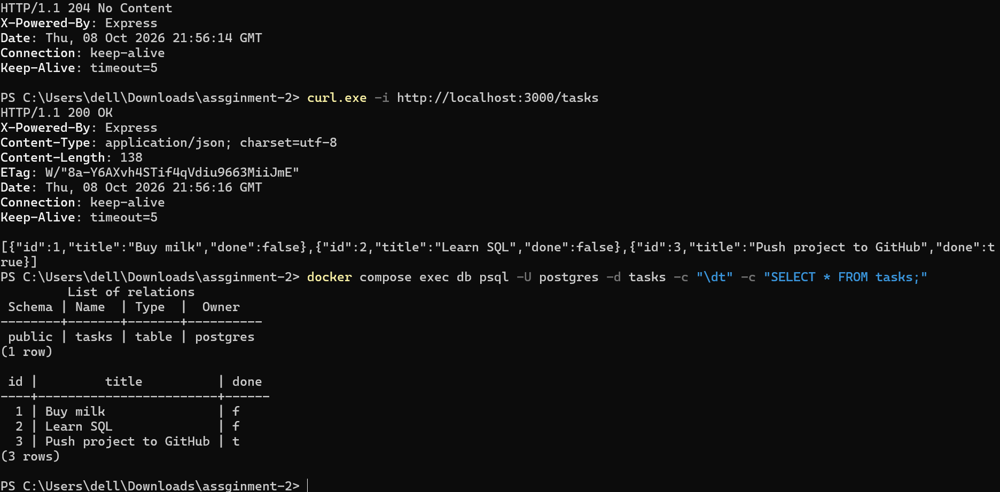

# Tasks API (Postgres + Docker)

CRUD tasks API built with Node.js and Express, now running against a real PostgreSQL database in Docker. The whole stack (API and database) starts with one command.

Storage history: memory (A1), SQLite (A2), Postgres in a container (A3). The routes and the API stayed the same each time.

## Run it
```bash
cp .env.example .env      # on Windows PowerShell: Copy-Item .env.example .env
docker compose up --build
Note: the database is published on host port 5433 (not 5432) because 5432 was already in use on my machine.
```
The API is at http://localhost:3000. The database table and three example tasks are created automatically on the first run.

## Environment variables
See `.env.example`. `.env` is git-ignored, so the real password is never committed.

| Variable | Purpose |
|----------|---------|
| POSTGRES_PASSWORD | Password for the Postgres container (also used by compose to build the API's connection string) |
| DATABASE_URL | Connection string used when running the app directly with `npm run dev` |

## Endpoints
| Method | Path | Success | Errors |
|--------|------|---------|--------|
| GET | /tasks | 200 | |
| GET | /tasks/:id | 200 | 404 `{ "error": "Task not found" }` |
| POST | /tasks | 201 | 400 if title is missing or empty |
| PUT | /tasks/:id | 200 | 400 invalid body, 404 unknown id |
| DELETE | /tasks/:id | 204 | 404 unknown id |

Example:
```
$ curl.exe -i http://localhost:3000/tasks
HTTP/1.1 200 OK
Content-Type: application/json; charset=utf-8

[{"id":1,"title":"Buy milk","done":false},{"id":2,"title":"Learn SQL","done":false},{"id":3,"title":"Push project to GitHub","done":true}]
```

## Architecture: what changed in this assignment
All database code lives in one file, db.js (the repository). server.js only handles routes and validation and contains no SQL. Swapping SQLite for Postgres meant writing db.js and adding the Dockerfile, compose.yaml and .env.example. I also had to edit server.js so each route awaits the async database calls (pg is asynchronous, better-sqlite3 was synchronous). The endpoints, status codes and response shapes did not change.

## How persistence was checked
1. Created a task with POST and marked it done with PUT.
2. Ran docker compose down, then docker compose up -d (without -v, so the volume is kept).
3. GET /tasks still returned the task, because the taskdata volume stores the database files outside the container.
4. Opened psql inside the container (docker compose exec db psql -U postgres -d tasks) and ran SELECT * FROM tasks; to see the same rows.

## Database screenshot


## Security notes
- All queries are parameterized (`$1`, `$2`), so user input is never glued into SQL.
- The password comes from `.env`, which is git-ignored.
