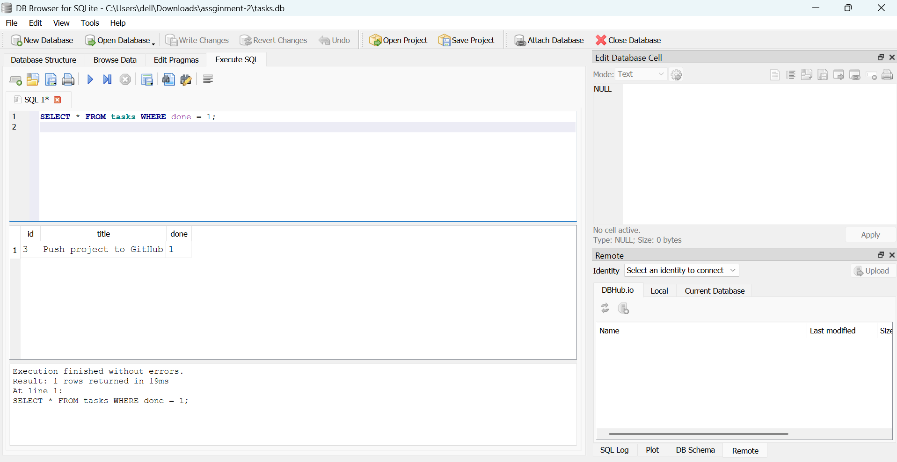

# Tasks API (SQLite)

A CRUD tasks API built with Node.js, Express and better-sqlite3. It is the same API as Assignment 1, but tasks are now stored in a SQLite database instead of memory, so data survives server restarts.

## Why SQLite?
- The whole database is a single file, so there is no server to install or run.
- It needs zero setup: the file is created automatically the first time the app starts.
- Data persists across restarts, which is exactly what this assignment needs.

## Where is the database?
`tasks.db` in the project root. It is created automatically on first run, along with the `tasks` table and three example tasks (inserted only when the table is empty). It is git-ignored, so every clone starts with a fresh database.

## How to start
```bash
npm install
npm start
```
The server runs on http://localhost:3000.

## Endpoints
| Method | Path | Success | Errors |
|--------|------|---------|--------|
| GET | /tasks | 200 | |
| GET | /tasks/:id | 200 | 404 `{ "error": "Task not found" }` |
| POST | /tasks | 201 | 400 if title is missing or empty |
| PUT | /tasks/:id | 200 | 400 invalid body, 404 unknown id |
| DELETE | /tasks/:id | 204 | 404 unknown id |

Try it:
```bash
curl -i http://localhost:3000/tasks
curl -i -X POST http://localhost:3000/tasks -H "Content-Type: application/json" -d '{"title":"Walk"}'
curl -i -X PUT http://localhost:3000/tasks/1 -H "Content-Type: application/json" -d '{"done":true}'
curl -i -X DELETE http://localhost:3000/tasks/1
```

## Schema
```sql
CREATE TABLE IF NOT EXISTS tasks (
  id    INTEGER PRIMARY KEY AUTOINCREMENT,
  title TEXT NOT NULL,
  done  INTEGER NOT NULL DEFAULT 0
);
```

## Database screenshot


## Example SQL query (Stage 4)
```sql
SELECT * FROM tasks WHERE done = 1;
```
Returned: <WRITE ONE SENTENCE ABOUT WHAT YOUR QUERY RETURNED>.

## Why identical tests passing proves storage is an implementation detail
The same curl commands from Assignment 1 give the same status codes and JSON shapes against the SQLite version. Because clients cannot tell the storage changed, the storage layer is just an implementation detail behind the API.

## Parameterized queries and transactions
All queries use `?` placeholders, so user input is never glued into SQL strings. The three seed inserts run inside a transaction so they all succeed or none do.
